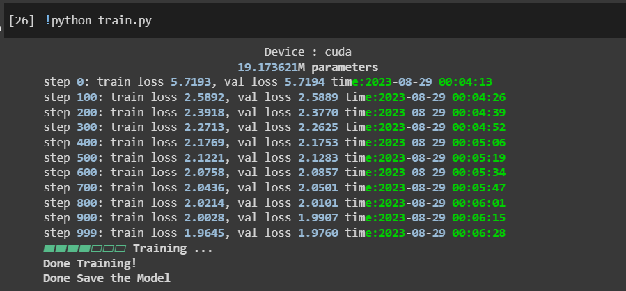
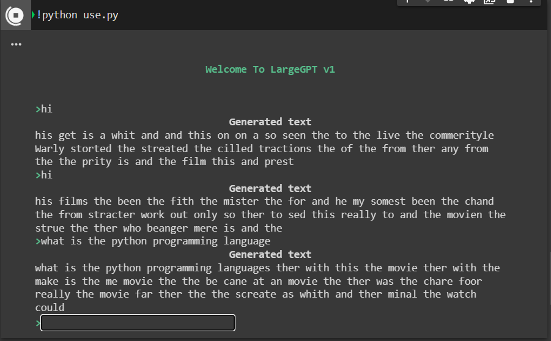

# LargeGPT Project - An AI-Powered Chatbot

Welcome to the LargeGPT project! This project is an AI-powered chatbot built from scratch by DrDataYE, without utilizing any external API services.


## ScreenShots

Training The Model


Use The Model LLM



## Installation

To use LargeGPT on your system, follow these steps:

1. Set up a virtual environment using your preferred environment manager (e.g., `virtualenv` or `conda`).
2. Activate the new environment.
3. Install dependencies using the following command:

```bash
pip install -r requirements.txt
```

# LargeGPT Language Model

This repository contains a PyTorch implementation of a Bigram Language Model. The model is based on the Transformer architecture and is designed for text generation tasks. It uses self-attention mechanisms to capture contextual information and generate coherent and contextually relevant text.

## Installation

1. Clone the repository:
   ```shell
   git clone https://github.com/your-username/bigram-language-model.git
   cd bigram-language-model
   ```

2. Install the required dependencies:
   ```shell
   pip install -r requirements.txt
   ```

## Usage

You can train the Bigram Language Model and use it for text generation using the following steps:

### Training

To train the model with custom hyperparameters, you can run the following command:

```shell
python train.py --batch_size 32 --block_size 64 --max_iters 2000 --learning_rate 0.001
```

Adjust the hyperparameters as needed. The training progress and evaluation results will be displayed in the console.

### Text Generation

After training the model, you can use it for text generation. To generate text based on a user input, run the following command:

```shell
python generate.py --input "Once upon a time in"
```

Replace the input text with your own text. The generated text will be displayed in the console.

## Hyperparameters

You can customize the model's behavior using various hyperparameters. Here are some of the available hyperparameters that you can configure:

- `--batch_size`: Batch size for training.
- `--block_size`: Maximum context length for predictions.
- `--max_iters`: Maximum number of training iterations.
- `--learning_rate`: Learning rate for optimization.
- `--device`: Device for training (cuda or cpu).
- `--eval_iters`: Number of iterations for evaluation.
- `--n_embd`: Number of embedding dimensions.
- `--n_head`: Number of attention heads.
- `--n_layer`: Number of layers in the model.
- `--dropout`: Dropout rate.

Feel free to experiment with different hyperparameters to achieve the best results for your specific text generation task.


## Installation in colab

1. Clone the repository:
   ```bash
   git clone https://github.com/DrDataYE/LargeGPT.git
   ```

2. Install the required packages:
   ```bash
   pip install -r requirements.txt
   ```

3. Move the files from the LargeGPT directory to the root:
   ```bash
   mv -if LargeGPT/* .
   ```

## Training

To train the LargeGPT model, run the following command:
```bash
python train.py
```

## Usage

To use the trained LargeGPT model, run the following command:
```bash
python use.py
```

## Dataset

To download and set up the IMDb dataset, run the following commands:
```bash
pip install datasets
python dataset.py -n imdb -o ./data/
```


## Training (Optional)

If you're interested in training your own GPT model, you can follow these steps:

1. Access the OpenAI website and obtain access to their API.
2. Modify the `train.py` file to suit your training needs and strategies.
3. Run the program to start the training process:

```bash
python train.py
```

## Contribution

If you're interested in contributing to the development of LargeGPT, we welcome contributions at all levels! Open a new issue to discuss proposed changes or submit a pull request from relevant branches.

## License

This project is licensed under the [LIM License](). Refer to the [LICENSE](LICENSE) file for more details.

---

LargeGPT was developed by DrDataYE. For inquiries, please contact us at [drdataye@gmail.com](mailto:drdataye@gmail.com) or visit our website [https://www.cyber1101.com](https://www.cyber1101.com).
